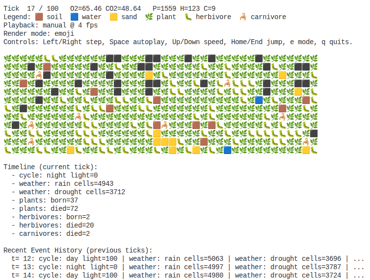

# 🌿 Terrarium Ecosystem Simulation

---

## **📌 Project Overview**

**Goal**: Develop a **closed ecosystem simulation** (Terrarium) where **plants, herbivores, and carnivores** interact in a **2D grid world** (250x250 cells). The simulation must balance **resources (O₂, CO₂, water, nutrients)**, **entity lifecycles**, and **combat mechanics** while allowing for **player interaction** (e.g., toggling a lid).

**Key Features**:

- Grid-based world with **terrain types** (soil, water, sand, empty).
- **Plants**: Grow, reproduce, and die based on resources.
- **Herbivores**: Move, eat plants, reproduce, and flee from carnivores.
- **Carnivores**: Move, eat herbivores/carnivores, reproduce, and **fight** (turn-based combat with AP).
- **Behavior Profiles**: Each insect is assigned a random behavior profile at birth, making populations naturally diverse.
- **Resource Cycles**: Global O₂/CO₂ pools, per-cell water/nutrients.
- **Player Actions**: Toggle lid (light/evaporation), add water/soil.



---

## **📜 Core Rules & Mechanics**

### **1. World (Grid System)**

- **Grid**: 250x250 cells (for testing).
- **Cell Types**:
  - **Soil**: 200 nutrients, regenerates **+0.1/tick**.
  - **Water**: 100 water, evaporates **-0.1/tick** (if lid is open).
  - **Sand**: No resources, **slows movement by 50%**.
  - **Empty**: Default.
- **Patches**: Connected cells of the same type (irregular shapes).
- **Adjacency**:
  - Plants spread to 4-directional neighbors.
  - Insect movement, drinking, hunting, and combat use 8-directional neighbors.
- **Lid Mechanic**:
  - **Open**: Light = 100%, evaporation = ON.
  - **Closed**: Light = 50%, evaporation = OFF.

**🔗 Diagram**: [Terrarium: Grid System](sandbox/terrarium-grid-system.md)

---

### **2. Plants**

- **Stages**:
  - **Seed (0-20)**: -0.2 nutrients/tick. Dies if growth < 10.
  - **Sprout (20-80)**: -0.5 nutrients/tick.
  - **Mature (80-100)**: -1 nutrient/tick. Can reproduce.
- **Growth**: +1 level/tick if **Light >= 50%**, **Water > 30%**, **Nutrients > 20%**.
- **Night Dormancy (Long Phases)**:
  - If `light = 0` but water/nutrients are still sufficient, plants shrink slowly by **-0.15/tick** (dormancy path).
  - Under true stress (insufficient water/nutrients), plants shrink by **-0.5/tick**.
- **Reproduction**:
  - **Conditions**: Mature, adjacent empty soil cell, nutrients > 50%.
  - **Cost**: -10 nutrients from parent cell.
- **Death**:
  - **<10 growth**: Die permanently.
  - **≥10 growth**: Wilt (recoverable if conditions improve for 3 ticks).
  - **Decay**: +50 nutrients to cell.

**🔗 Diagram**: [Terrarium: Plants Lifecycle](sandbox/terrarium-plants-lifecycle.md)

---

### **3. Herbivores**

- **Aging**: Egg (4 ticks) → Larva (2 ticks) → Adult.
- **Energy**:
  - **Passive Loss**: -0.1/tick (scaled by `nightMetabolismMultiplier = 0.7` at night).
  - **No nearby drinkable water**: -0.5 energy/tick.
  - **Starvation**: Die if energy ≤ 0 for 5 ticks.
- **Movement**:
  - Uses a step-charge model (recharge +1.2/tick, cap 2.5).
  - **Soil**: cost 1.0 step-charge, -0.8 energy.
  - **Sand**: cost 1.5 step-charge, -0.8 energy.
  - Roaming uses anti-backtrack bias to reduce oscillation.
- **Eating**:
  - **Targeting**: Scan within radius 2 and move toward nearest plant.
  - **Consume Plant**: +5 energy (80% success if adjacent).
- **Fleeing**:
  - **20% chance to escape** carnivore attacks.
  - **Cost**: -1 energy, move 1 cell away (8-directional).
- **Reproduction**:
  - **Conditions**: Energy ≥ 14, cooldown 18, 12% chance, adjacent empty walkable cell.
  - **Crowding gates**:
    - Local gate: reproduction blocked when nearby herbivore count in 8-neighborhood reaches 3.
    - Global gate: reproduction blocked when live herbivores reach `plants * 0.0095`.
  - **Cost**: -6 energy.
- **Longevity**:
  - **Max age**: 320 ticks.

**🔗 Diagram**: [Terrarium: Herbivore Insects Lifecycle](sandbox/terrarium-herbivore-insects-lifecycle.md)

---

### **4. Carnivores**

- **Aging**: Egg (2 ticks) → Larva (1 tick) → Adult.
- **Energy**:
  - **Passive Loss**: -0.04/tick (scaled by `nightMetabolismMultiplier = 0.7` at night).
  - **No nearby drinkable water**: -0.2 energy/tick.
  - **Starvation**: Die if energy ≤ 0 for 8 ticks.
- **Attack Points (AP)**:
  - **Max**: 10.
  - **Regeneration**: +1/tick (passive).
  - **Death**: AP resets to 0.
- **Movement**:
  - Uses same step-charge model as herbivores.
  - **Soil**: cost 1.0 step-charge, -0.5 energy.
  - **Sand**: cost 1.5 step-charge, -0.5 energy, and -1 AP (terrain strain).
- **Combat**:
  - **Attack Cost**: 3 AP.
  - **Per-Turn Action Cap**: 1 attack action per tick, plus at most 1 chase.
  - **Herbivore Hunt**:
    - 20% chance herbivore escapes (flees 1 cell); otherwise attack resolves.
    - If caught: -2 energy to herbivore. If herbivore dies: +7 energy, +5 AP.
    - Hunt targeting radius: 4 cells.
  - **Carnivore vs. Carnivore**:
    - Opportunistic (not mandatory): only when adjacent, AP >= 3, energy >= 9, and 12% chance.
    - Both lose -2 energy per fight exchange.
    - If rival dies: winner gains +5 energy, +5 AP.
  - **Chasing**:
    - If herbivore flees, carnivore can chase once per turn (1 step).
  - **No-prey rest behavior**:
    - When no target herbivore is found, carnivore rests with 85% chance and recovers +0.3 energy.
- **Reproduction**:
  - **Conditions**: Energy ≥ 16, cooldown 16, 10% chance, adjacent empty walkable cell.
  - **Crowding gates**:
    - Local gate: reproduction blocked when nearby carnivore count in 8-neighborhood reaches 2.
    - Global gate: reproduction blocked when live carnivores reach `herbivores * 0.3`.
  - **Cost**: -7 energy, AP = 0.
- **Longevity**:
  - **Max age**: 180 ticks.

**🔗 Diagram**: [Terrarium: Carnivore Insects Lifecycle](sandbox/terrarium-carnivore-insects-lifecycle.md)

---

### **5. Resources**

#### **Global Pools**

- **Normalization**: O₂ and CO₂ are normalized percentages in the range 0-100 and are clamped each tick.
- **O₂**: Initial = 100.
  - **Plants**: +2/tick per 10 living plants (photosynthesis).
  - **Insects**: -1/tick per 10 living insects (respiration).
  - **Imbalance**: O₂ < 10 → insects lose -1 energy/tick.
- **CO₂**: Initial = 50.
  - **Plants**: -1/tick per 10 living plants (consumption).
  - **Insects**: +1/tick per 10 living insects (production).
  - **Imbalance**: CO₂ > 90 → plants grow at 50% rate.

#### **Per-Cell Resources**

- **Water**:
  - **Rain**: +8/cell (11% chance/tick).
  - **Drought**: -3/cell (4% chance/tick).
  - **Evaporation**: -0.16/tick (if lid is open).
  - **Seepage from water terrain**: water cells receive +1.2/tick baseline moisture.
  - **Adjacent seepage**: non-water cells gain +0.35 per 4-neighbor water cell.
  - **Insect Drinking**: -0.5 from nearby (8-neighbor) water cell.
- **Nutrients**:
  - **Soil Regeneration**: +0.1/tick/cell.
  - **Depletion**: If <10 in a cell, plants wilt.
  - **Decay**:
    - Dead plants add +50 nutrients to their cell.
    - Dead herbivores/carnivores add +20 nutrients to their cell.

**🔗 Diagram**: [Terrarium: Resource Cycle](sandbox/terrarium-resource-cycle.md)

---

### **6. Game Loop (Per Tick)**

1. **Day/Night Cycle**: Day and night each span configurable tick windows (`climate.dayTicks` / `climate.nightTicks`).
2. **Weather**: Roll for rain/drought.
3. **Resource Regeneration**: Soil +0.1 nutrients/cell, and water updates from weather + evaporation + seepage.
4. **Entity Actions**:
   - **Plants**: Grow, reproduce, or wilt/die.
   - **Insects**: Move, eat, reproduce, fight, or die.
5. **Decay**: Process dead entities → add nutrients to soil.
6. **Win/Lose Check**:

   - **Lose**:
     - O₂ < 10 for 3 consecutive ticks, or
     - CO₂ > 90 for 3 consecutive ticks, or
     - no water cell has water > 1 for 3 consecutive ticks, or
     - all plants die, or all insects die.
   - **Win**: Ecosystem survives 100 ticks.

---

### **7. Canonical Conflict-Resolution Rules (Prototype)**

Use this section as the source of truth if any diagram and prose disagree.

| Rule Area                      | Canonical Rule                                                                                                |
| ------------------------------ | ------------------------------------------------------------------------------------------------------------- |
| Adjacency model                | Plants spread in 4-neighborhood; insect interactions use 8-neighborhood                                       |
| Movement model                 | Step-charge based; sand step-cost is 1.5 for both insect types                                                |
| Carnivore on sand              | -0.5 energy move cost and -1 AP                                                                               |
| Herbivore flee roll            | 20% escape success; 80% attack resolves                                                                       |
| Carnivore turn economy         | Max 1 attack action and 1 chase per tick                                                                      |
| Insect lifecycle               | Herbivore egg/larva: 4/2 ticks; carnivore egg/larva: 2/1 ticks                                                |
| Herbivore breeding gate        | Energy >= 14, cooldown 18, chance 12%, cost 6                                                                 |
| Carnivore breeding gate        | Energy >= 16, cooldown 16, chance 10%, cost 7                                                                 |
| Reproduction crowding controls | Herbivore local cap 3 and global cap plants \* 0.0095; carnivore local cap 2 and global cap herbivores \* 0.3 |
| Night metabolism               | Insect passive metabolism is multiplied by 0.7 at night                                                       |
| Starvation windows             | Herbivore: 5 ticks at non-positive energy; carnivore: 8 ticks                                                 |
| Lifespan contrast              | Herbivores live much longer (max 320) than carnivores (max 180)                                               |
| Plant growth light threshold   | Growth allowed at light >= 50                                                                                 |
| Decay rewards                  | Plant: +50 nutrients; insect: +20 nutrients                                                                   |
| Gas bounds                     | O₂/CO₂ are clamped to 0-100 each tick                                                                         |
| Water-loss condition           | Trigger only after 3 ticks with no cell above water > 1                                                       |

**🔗 Diagram**: [Terrarium: Main Game Loop](sandbox/terrarium-main-game-loop.md)

---

## **🧭 Mechanics Clarity (Quick Read)**

Use this section as a fast guide to what is implemented now vs. what is design intent.

### **Implementation Status (Prototype)**

| System                           | Status      | Notes                                                                                                |
| -------------------------------- | ----------- | ---------------------------------------------------------------------------------------------------- |
| Grid + terrain patches           | Implemented | 2D world, terrain generation, per-cell resources in `src/world.ts`                                   |
| Plants lifecycle                 | Implemented | Growth, reproduction, wilt/death, decay feedback                                                     |
| Herbivore lifecycle              | Implemented | Stage aging, movement, feeding, fleeing, breeding gates                                              |
| Carnivore lifecycle + AP combat  | Implemented | Hunt/chase logic, AP spend/regen, opportunistic rival fights                                         |
| Resource cycles                  | Implemented | O2/CO2 pools, water weather/seepage, nutrient regen/decay                                            |
| Replay + diagnostics             | Implemented | Tick timeline, event history, CSV + JSON replay output                                               |
| Player actions beyond lid config | Partial     | Lid state is configurable at run start; interactive add-water/add-soil tools are not yet in CLI loop |

### **Per-Tick Execution Order (Source of Truth)**

| Order | Phase                  | Effect                                                    |
| ----: | ---------------------- | --------------------------------------------------------- |
|     1 | Day/Night phase update | Applies light and metabolism multipliers                  |
|     2 | Weather roll           | Triggers rain/drought events                              |
|     3 | Resource update        | Applies evaporation, seepage, soil regen, gas flux        |
|     4 | Entity actions         | Plants act first, then insects (move/eat/fight/reproduce) |
|     5 | Decay pass             | Dead entities convert into nutrients                      |
|     6 | Outcome checks         | Evaluates loss streaks and win condition                  |

### **Glossary**

- **Step-charge**: Movement budget that recharges per tick and is spent per move (sand costs more).
- **Local cap**: Reproduction block based on nearby same-species count in the 8-neighborhood.
- **Global cap**: Reproduction block based on population ratio (herbivores vs plants, carnivores vs herbivores).
- **Wilt state**: Plant stress state above hard-death threshold that can recover with sustained good conditions.
- **Chase allowance**: Carnivore may perform at most one follow-up chase after a flee in the same tick.

### **Known Simplifications (Current Prototype)**

- Gas dynamics include damping/centering behavior, so O2/CO2 stability is partly model-assisted and not purely emergent.
- Console replay can render sampled previews by default for readability; native-size mode is optional.
- Simulation focuses on ecosystem loop tuning first; rich direct player interaction is intentionally minimal at this stage.

### **How To Read Outcomes Quickly**

- A `WIN` at tick 100 means survival constraints held, not that biodiversity is balanced.
- Use diagnostics to inspect births/deaths and predation totals before changing tuning values.
- Use replay timeline and recent event history to map sudden population drops to weather/combat/resource events.

---

## **🧪 Prototype Simulator (Node.js)**

The repository now includes an executable prototype simulator in `src/`.

### **Run Commands**

- Install/runtime: Node.js 22+ and pnpm.
- Single run (100 ticks) and automatically save replay artifacts to `runs/latest.csv` and compressed replay `runs/latest.json.gz`:

```bash
pnpm simulate
```

The single-run summary now includes a **Diagnostics** block with births, deaths, predation/rival kills, and egg visibility statistics.

- Sweep 5 seeds:

```bash
pnpm simulate:sweep
```

- Custom run:

```bash
pnpm simulate --ticks 100 --seed my-seed --plants 1800 --herbivores 180 --carnivores 70 --lid open
```

- Custom run with longer day/night phases:

```bash
pnpm simulate --ticks 300 --seed long-run --day-ticks 4 --night-ticks 4
```

- Custom run with explicit behavior profiles:

```bash
pnpm simulate --ticks 150 --seed profile-test --herbivore-behavior forager --carnivore-behavior aggressive
```

- Record per-tick CSV + replay JSON:

```bash
pnpm simulate --ticks 100 --seed my-seed --record-csv runs/my-seed.csv --record-json runs/my-seed.json.gz
```

- Replay latest run with keyboard navigation:

```bash
pnpm replay
```

### **Build and Quality Pipeline**

- Typecheck:

```bash
pnpm typecheck
```

- Build distributable output:

```bash
pnpm build
```

- Lint (OXC):

```bash
pnpm lint
```

- Format (Oxfmt):

```bash
pnpm format
```

- Check formatting (Oxfmt):

```bash
pnpm format:check
```

- Run tests (Vitest):

```bash
pnpm test
```

- Run full gate (typecheck + build + lint + tests):

```bash
pnpm check
```

Build artifacts are written to `dist/`.

- Replay a specific file:

```bash
pnpm simulate --replay runs/my-seed.json.gz
```

- Replay with autoplay enabled on startup:

```bash
pnpm simulate --replay runs/my-seed.json.gz --autoplay --fps 6
```

- Replay with native board dimensions (full 250x250 render):

```bash
pnpm simulate --replay latest --native-size
```

### **CLI Options**

- `--ticks <number>`: total ticks (default `100`)
- `--size <number>`: world width/height (default `250`)
- `--seed <string>`: deterministic seed
- `--plants <number>`: initial plant count
- `--herbivores <number>`: initial herbivore count
- `--carnivores <number>`: initial carnivore count
- `--lid <open|closed>`: lid state
- `--day-ticks <number>`: number of ticks per day phase (default `1`)
- `--night-ticks <number>`: number of ticks per night phase (default `1`)
- `--sweep`: run fixed 5-seed stability sweep
- `--record-csv <path>`: write per-tick aggregate metrics CSV
- `--record-json <path>`: write replay JSON at path (compressed by default)
- `--record-json-gzip`: force gzip-compressed replay output (default)
- `--record-json-plain`: force plain `.json` replay output
- `--replay <path>`: launch interactive replay from recorded JSON (`.json` or `.json.gz`)
- `--replay latest`: auto-load newest replay JSON (`.json`/`.json.gz`) under `runs/`
- `--autoplay`: start replay in autoplay mode
- `--fps <number>`: autoplay speed in frames/tick-steps per second
- `--emoji`: force emoji render mode (default)
- `--ascii`: force ASCII render mode
- `--auto-fit`: auto-fit replay viewport for emoji mode (default: on)
- `--no-auto-fit`: disable auto-fit and keep configured preview dimensions
- `--native-size`: render replay at world dimensions (`size x size`) instead of sampled preview
- `--preview-width <number>`: replay render width (default `64`)
- `--preview-height <number>`: replay render height (default `24`)

### **Configuration**

The simulator uses baseline defaults from `src/config.ts` and then applies CLI overrides.

- Override precedence:
  1. `DEFAULT_CONFIG` in `src/config.ts`
  2. CLI flags passed to `pnpm simulate ...`

- Common tuning groups:
  - **World**: `world.size`, `world.ticks`, `world.seed`, `world.lidOpen`
  - **Climate**: `climate.dayTicks`, `climate.nightTicks`, weather values, gas balancing, night metabolism multiplier
  - **Biome**: seepage and terrain-adjacent moisture settings
  - **Plants**: `plants.initialCount`, reproduction chance, and stress/dormancy shrink values
  - **Insects**: shared drinking/movement settings plus species-specific trees under `insects.herbivores` and `insects.carnivores`

- Practical workflow:
  1. Keep `src/config.ts` as the canonical baseline.
  2. Use CLI flags for scenario experiments (`--ticks`, `--day-ticks`, `--night-ticks`, initial populations).
  3. Promote stable scenario values back into `src/config.ts` once validated.

- Anti-overpopulation controls:
  - Herbivores: `insects.herbivores.breed.chance`, `insects.herbivores.breed.cooldown`, `insects.herbivores.breed.localCap`, `insects.herbivores.breed.populationCapPerPlant`
  - Carnivores: `insects.carnivores.breed.chance`, `insects.carnivores.breed.cooldown`, `insects.carnivores.breed.localCap`, `insects.carnivores.breed.populationCapPerHerbivore`

### **Behavior Profiles**

Each insect is independently assigned a random behavior profile when it is born (initial seeding and all offspring). This means a single simulation run will contain a naturally diverse population — some carnivores will be aggressive, others passive; some herbivores will be wide-ranging foragers, others default seekers.

- Herbivore profiles: `default`, `forager`
- Carnivore profiles: `default`, `aggressive`, `passive`

| Profile      | Species   | Effect                                                       |
| ------------ | --------- | ------------------------------------------------------------ |
| `default`    | Herbivore | Seeks plants within radius 2, eats with 80% success          |
| `forager`    | Herbivore | Wider plant search (radius 3), eats with 90% success         |
| `default`    | Carnivore | Baseline hunt / rest / rival-fight behaviour                 |
| `aggressive` | Carnivore | Wider hunt radius, less resting, higher rival-fight chance   |
| `passive`    | Carnivore | Narrower hunt radius, more resting, lower rival-fight chance |

Behavior profiles are not configurable per-run from the CLI — the population mix is determined by the RNG seed, giving each seed a unique character.

### **Adding a New Insect Species**

The simulator is designed so a new insect type can be contributed without touching the simulator, context, or repository. The contribution checklist is:

| Step | File to create                                                      | What goes there                                                                                                                                      |
| ---: | ------------------------------------------------------------------- | ---------------------------------------------------------------------------------------------------------------------------------------------------- |
|    1 | `src/entities/insects/my-insect.ts`                                 | Class extending `Insect`, lifecycle parameters, hooks                                                                                                |
|    2 | `src/behaviors/my-insect/`                                           | Strategy class implementations for the species                                                                                                        |
|    3 | `src/behaviors/behavior-factory.ts`                                 | Wire `resolveMyInsectBehavior` (one function, two lines)                                                                                             |
|    4 | `src/entities/insects/my-insect.ts` (bottom)                        | `insectRegistry.register({ kind, behaviorIds, seedEnergyRange, initialCount, create })`                                                              |
|    5 | `src/config.ts` (optional)                                          | Add `initialMyInsects: 0` if a tunable starting population is needed                                                                                 |

Once registered, the simulator automatically seeds, ticks, and counts the new species — no other changes needed.

Contributors can import the grouped entity barrels through the existing `@` alias, for example `@/entities/insects` and `@/entities/plants`.

**Minimal example skeleton** (`src/entities/insects/decomposer.ts`):

```typescript
import { Insect, insectRegistry } from '@/entities/insects';
import {
  DECOMPOSER_BEHAVIOR_IDS,
  type DecomposerBehaviorId,
  type InsectBehaviorStrategy,
  resolveDecomposerBehavior,
} from '@/behaviors';

export class Decomposer extends Insect {
  readonly behaviorId: DecomposerBehaviorId;
  private readonly behavior: InsectBehaviorStrategy<Decomposer>;
  private readonly _config: SimulationConfig;

  constructor(id, cell, energy, config, behaviorId) {
    super('decomposer', id, cell, energy);
    this._config = config;
    this.behaviorId = behaviorId;
    this.behavior = resolveDecomposerBehavior(behaviorId);
  }

  spawnOffspring(ctx, cell) {
    const behaviorId = ctx.rng.pick(DECOMPOSER_BEHAVIOR_IDS) ?? 'default';
    return new Decomposer(ctx.nextId('d'), cell, 4, this._config, behaviorId);
  }

  // ... lifecycle getters and hooks ...

  protected tickBehavior(ctx) {
    this.behavior.tick(this, ctx);
  }
}

insectRegistry.register({
  kind: 'decomposer',
  behaviorIds: DECOMPOSER_BEHAVIOR_IDS,
  seedEnergyRange: [4, 8],
  initialCount: (config) => config.initialDecomposers ?? 0,
  create: (id, cell, energy, config, behaviorId) => new Decomposer(id, cell, energy, config, behaviorId),
});
```

### **Adding a New Plant Type**

Plants extend `Entity` directly and are simpler to add:

1. Create `src/entities/plants/my-plant.ts` extending `Plant` (or `Entity` for a fully custom tick loop).
2. Override `tick(ctx): Plant | null` — return a child instance on reproduction, `null` otherwise.
3. In the simulator's `seedInitialPopulation`, instantiate your plant class alongside the built-in `Plant`.

No registration mechanism is needed for plants because the simulator already processes every entry in `entities.plants` uniformly regardless of class type.

### **Architecture Notes: Strategy + Repository + Events**

The entity architecture separates concerns into a few stable boundaries:

- Concrete implementations live under `src/entities/plants/` and `src/entities/insects/`.
- Consumers can use the mapped barrels `@/entities/plants` and `@/entities/insects` for extension code instead of deep relative paths.
- Plants and insects own lifecycle and mutable state.
- Behavior strategies own decision-making policy and can be swapped without rewriting lifecycle plumbing.
- Species registration is the integration point for adding new insect types.
- Repository and event layers keep collection management and replay/timeline output outside individual entities.

This keeps lifecycle/state in entities and policy logic in strategy modules, enabling easier experimentation without rewriting core lifecycle plumbing.

### **Replay Controls**

- `Left Arrow`: previous tick
- `Right Arrow`: next tick
- `Space`: toggle autoplay on/off
- `Up Arrow`: increase autoplay speed
- `Down Arrow`: decrease autoplay speed
- `Home`: jump to first tick
- `End`: jump to last tick
- `e`: toggle emoji/ascii mode
- `n`: toggle sampled/native viewport mode
- `q`: quit replay

When auto-fit is enabled, emoji mode uses a smaller sampled viewport by default for better readability.
Use `--native-size` when you want the board view to match the true world dimensions (for example 250x250).

### **Replay Timeline Panel**

The replay viewer includes a per-tick timeline section below the ASCII map.

- Shows key events for the selected tick:
  - cycle phase (`day`/`night`)
  - weather (`rain`/`drought` affected cell counts)
  - births/deaths for plants, herbivores, and carnivores
  - predation/combat kill counts
  - warning streaks (`low-o2`, `high-co2`, `low-water`)

This helps debug why population and resource curves changed at a specific tick.

It also includes a **Recent Event History** panel showing event summaries from the previous 5 ticks, so you can trace immediate cause/effect without stepping back manually.

Replay symbol legend:

- ASCII: `.` soil, `~` water, `:` sand, `[space]` empty, `*` plant, `h` herbivore, `C` carnivore, `o` egg
- Emoji: `🟫` soil, `🟦` water, `🟨` sand, `⬛` empty, `🌿` plant, `🐛` herbivore, `🦂` carnivore, `🥚` egg

### **Recording Format Guidance**

- **CSV** is lightweight and ideal for charting metrics over time.
  - Contains aggregated per-tick values (O2, CO2, populations, water metrics).
- **JSON replay** is richer and designed for deterministic console playback.
  - Contains world terrain and per-tick entity positions.
  - Default output is gzip-compressed (`.json.gz`) to reduce file size.
  - Use `--record-json-plain` if you explicitly need uncompressed JSON.

---

## **📊 Prototype Baseline Report (2026-07-08)**

### **Single Baseline Run**

- Command: `pnpm simulate --ticks 100 --seed baseline-5`
- Outcome: **WIN** (`survived 100 ticks`)
- Final state: plants `1542`, herbivores `4`, carnivores `2`, O2 `55.48`, CO2 `47.28`

### **5-Seed Sweep**

| Seed    | Outcome | Final Tick | Plants | Insects |    O2 |   CO2 |
| ------- | ------- | ---------: | -----: | ------: | ----: | ----: |
| alpha   | win     |        100 |   1480 |       6 | 55.24 | 47.40 |
| beta    | win     |        100 |   1446 |       8 | 55.10 | 47.47 |
| gamma   | win     |        100 |   1462 |       3 | 55.21 | 47.41 |
| delta   | win     |        100 |   1529 |       6 | 55.43 | 47.31 |
| epsilon | win     |        100 |   1474 |       5 | 55.27 | 47.38 |

### **Current Balance Gaps (Expected for Prototype)**

1. **Biodiversity is fragile**: insects survive to tick 100, but total insect count trends low.
2. **Gas center bias**: O2/CO2 currently stabilize around mid-range due damping, not pure ecosystem equilibrium.
3. **Predator pressure sensitivity**: small changes to carnivore count/AP regen still shift outcomes noticeably.

These are the primary targets for the next tuning pass.

---

### **🔗 Quick Links to Diagrams**

| System              | Canvas Link                                                                               |
| ------------------- | ----------------------------------------------------------------------------------------- |
| Grid System         | [terrarium-grid-system](sandbox/terrarium-grid-system.md)                                 |
| Plants Lifecycle    | [terrarium-plants-lifecycle](sandbox/terrarium-plants-lifecycle.md)                       |
| Herbivore Lifecycle | [terrarium-herbivore-insects-lifecycle](sandbox/terrarium-herbivore-insects-lifecycle.md) |
| Carnivore Lifecycle | [terrarium-carnivore-insects-lifecycle](sandbox/terrarium-carnivore-insects-lifecycle.md) |
| Resource Cycle      | [terrarium-resource-cycle](sandbox/terrarium-resource-cycle.md)                           |
| Main Game Loop      | [terrarium-main-game-loop](sandbox/terrarium-main-game-loop.md)                           |

---

### **💡 Notes for Contributors**

- **Change one system at a time**: Tune plants, herbivores, and carnivores in isolated passes to make regressions easier to spot.
- **Record before/after runs**: Capture CSV and replay JSON when changing balance values so outcomes are comparable across seeds.
- **Prefer config-based tuning**: Keep stable defaults in `src/config.ts` and use CLI flags for short experiments.
- **Keep docs in sync**: If rules change, update both this README and the related sandbox Mermaid diagram.
