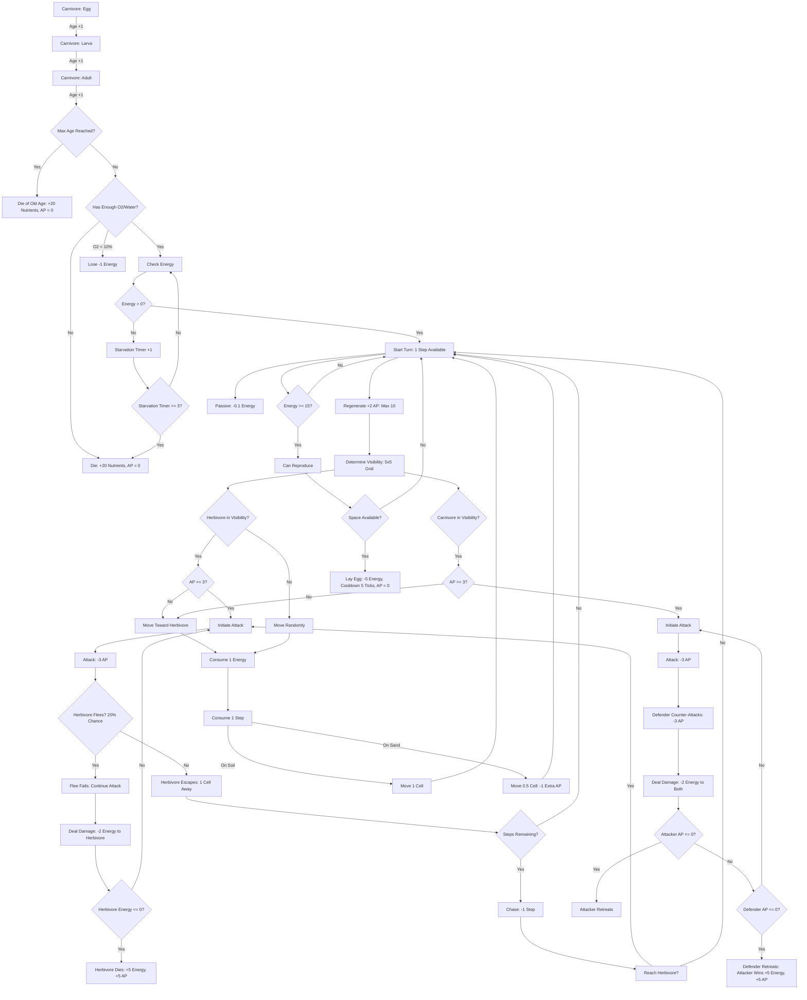

```mermaid
flowchart TD
    direction TB
    %% Carnivore Insects
    C1[Carnivore: Egg] -->|Age +1| C2[Carnivore: Larva]
    C2 -->|Age +1| C3[Carnivore: Adult]
    C3 -->|Age +1| C4{Max Age Reached?}
    C4 -->|Yes| C5[Die of Old Age: +20 Nutrients, AP = 0]
    C4 -->|No| C6{Has Enough O2/Water?}
    C6 -->|No| C7[Die: +20 Nutrients, AP = 0]
    C6 -->|Yes| C8[Check Energy]
    C8 --> C9{Energy > 0?}
    C9 -->|No| C10[Starvation Timer +1]
    C10 --> C11{Starvation Timer >= 3?}
    C11 -->|Yes| C7
    C11 -->|No| C8
    C9 -->|Yes| C12[Start Turn: 1 Step Available]
    
    %% AP Regeneration
    C12 --> C12A[Regenerate +2 AP: Max 10]
    C12A --> C13[Determine Visibility: 5x5 Grid]
    
    %% Movement and Actions
    C13 --> C14{Herbivore in Visibility?}
    C14 -->|Yes| C15{AP >= 3?}
    C15 -->|Yes| C16[Initiate Attack]
    C15 -->|No| C17[Move Toward Herbivore]
    C14 -->|No| C18[Move Randomly]
    
    %% Attack Mechanics
    C16 --> C19[Attack: -3 AP]
    C19 --> C20{Herbivore Flees? 20% Chance}
    C20 -->|Yes| C21[Flee Fails: Continue Attack]
    C20 -->|No| C22[Herbivore Escapes: 1 Cell Away]
    C22 --> C22A{Steps Remaining?}
    C22A -->|Yes| C22B[Chase: -1 Step]
    C22A -->|No| C12
    C22B --> C23[Reach Herbivore?]
    C23 -->|Yes| C16
    C23 -->|No| C12
    C21 --> C24[Deal Damage: -2 Energy to Herbivore]
    C24 --> C25{Herbivore Energy <= 0?}
    C25 -->|Yes| C26[Herbivore Dies: +5 Energy, +5 AP]
    C25 -->|No| C16
    
    %% Carnivore vs Carnivore Combat
    C13 --> C27{Carnivore in Visibility?}
    C27 -->|Yes| C28{AP >= 3?}
    C28 -->|Yes| C29[Initiate Attack]
    C28 -->|No| C17
    C29 --> C30[Attack: -3 AP]
    C30 --> C31[Defender Counter-Attacks: -3 AP]
    C31 --> C32[Deal Damage: -2 Energy to Both]
    C32 --> C33{Attacker AP <= 0?}
    C33 -->|Yes| C34[Attacker Retreats]
    C33 -->|No| C35{Defender AP <= 0?}
    C35 -->|Yes| C36[Defender Retreats: Attacker Wins +5 Energy, +5 AP]
    C35 -->|No| C29
    
    %% Movement
    C17 --> C37[Consume 1 Energy]
    C18 --> C37
    C37 --> C38[Consume 1 Step]
    C38 -->|On Soil| C39[Move 1 Cell]
    C38 -->|On Sand| C40[Move 0.5 Cell: -1 Extra AP]
    C39 --> C12
    C40 --> C12
    
    %% Passive Energy Loss
    C12 --> C41[Passive: -0.1 Energy]
    
    %% O2/CO2 Imbalance
    C6 -->|O2 < 10%| C42[Lose -1 Energy]
    
    %% Reproduction
    C12 --> C43{Energy >= 15?}
    C43 -->|Yes| C44[Can Reproduce]
    C43 -->|No| C12
    C44 --> C45{Space Available?}
    C45 -->|Yes| C46[Lay Egg: -5 Energy, Cooldown 5 Ticks, AP = 0]
    C45 -->|No| C12
```
