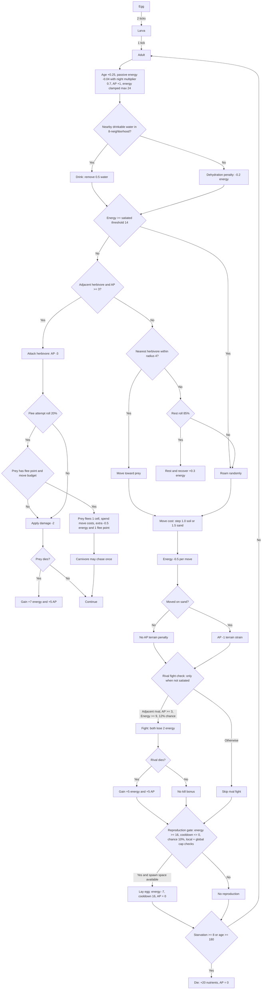

# Terrarium Carnivore Insects Lifecycle

```mermaid
flowchart TD
    direction TB
    C1[Egg] -->|2 ticks| C2[Larva]
    C2 -->|1 tick| C3[Adult]

    C3 --> C4[Age +0.25, passive energy -0.04 with night multiplier 0.7, AP +1, energy clamped max 24]
    C4 --> C5{Nearby drinkable water in 8-neighborhood?}
    C5 -->|Yes| C6[Drink: remove 0.5 water]
    C5 -->|No| C7[Dehydration penalty: -0.2 energy]

    C6 --> C7A{Energy >= satiated threshold 14}
    C7 --> C7A
    C7A -->|Yes| C20[Roam randomly]
    C7A -->|No| C8{Adjacent herbivore and AP >= 3?}

    C8 -->|Yes| C9[Attack herbivore: AP -3]
    C9 --> C10{Flee attempt roll 20%}
    C10 -->|Yes| C10A{Prey has flee point and move budget}
    C10A -->|Yes| C11[Prey flees 1 cell, spend move costs, extra -0.5 energy and 1 flee point]
    C10A -->|No| C12[Escape fails apply damage -2]
    C10 -->|No| C12[Apply damage -2]
    C12 --> C13{Prey dies?}
    C13 -->|Yes| C14[Gain +7 energy and +5 AP]
    C13 -->|No| C15[Continue]
    C11 --> C11A[Carnivore may chase once]
    C11A --> C15

    C8 -->|No| C16{Nearest herbivore within radius 4?}
    C16 -->|Yes| C17[Move toward prey]
    C16 -->|No| C18{Rest roll 85%}
    C18 -->|Yes| C19[Rest and recover +0.3 energy]
    C18 -->|No| C20[Roam randomly]

    C17 --> C21[Move cost: step 1.0 soil or 1.5 sand]
    C20 --> C21
    C21 --> C22[Energy -0.5 per move]
    C22 --> C23{Moved on sand?}
    C23 -->|Yes| C24[AP -1 terrain strain]
    C23 -->|No| C25[No AP terrain penalty]

    C25 --> C26{Rival fight check: only when not satiated}
    C24 --> C26
    C26 -->|Adjacent rival, AP >= 3, Energy >= 9, 12% chance| C27[Fight: both lose 2 energy]
    C26 -->|Otherwise| C28[Skip rival fight]

    C27 --> C29{Rival dies?}
    C29 -->|Yes| C30[Gain +5 energy and +5 AP]
    C29 -->|No| C31[No kill bonus]

    C30 --> C32{Reproduction gate: energy >= 16, cooldown <= 0, chance 10%, local + global cap checks}
    C31 --> C32
    C28 --> C32
    C32 -->|Yes and spawn space available| C33[Lay egg: energy -7, cooldown 16, AP = 0]
    C32 -->|No| C34[No reproduction]

    C33 --> C35{Starvation >= 8 or age >= 180}
    C34 --> C35
    C35 -->|Yes| C36[Die: +20 nutrients, AP = 0]
    C35 -->|No| C3
```
