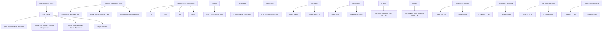

```mermaid
flowchart TD
    %% Grid System Overview
    A[Grid: 250x250 Cells] --> B[Cell Types]
    B --> C[Soil: 200 Nutrients, +0.1/tick]
    B --> D[Water: 100 Water, -0.1/tick Evaporation]
    B --> E[Sand: No Resources, Slows Movement]
    B --> F[Empty: Default]
    
    %% Patches
    G[Patches: Connected Cells] --> H[Soil Patch: Multiple Cells]
    G --> I[Water Patch: Multiple Cells]
    G --> J[Sand Patch: Multiple Cells]
    
    %% Adjacency Rules
    K[Adjacency: 4-Directional] --> L[Up]
    K --> M[Down]
    K --> N[Left]
    K --> O[Right]
    
    %% Entity Placement
    P[Plants] --> Q[Can Only Grow on Soil]
    R[Herbivores] --> S[Can Move on Soil/Sand]
    T[Carnivores] --> U[Can Move on Soil/Sand]
    
    %% Lid Mechanic
    V[Lid: Open] --> W[Light: 100%]
    V --> X[Evaporation: ON]
    Y[Lid: Closed] --> Z[Light: 50%]
    Y --> AA[Evaporation: OFF]
    
    %% Resource Access
    AB[Plants] --> AC[Consume Nutrients from Soil Cell]
    AD[Insects] --> AE[Drink Water from Adjacent Water Cell]
    
    %% Movement Costs
    AF[Herbivores on Soil] --> AG[1 Step = 1 Cell]
    AF --> AH[1 Energy/Step]
    AI[Herbivores on Sand] --> AJ[2 Steps = 1 Cell]
    AI --> AK[1 Energy/Step]
    
    AL[Carnivores on Soil] --> AM[1 Step = 1 Cell]
    AL --> AN[1 Energy/Step]
    AO[Carnivores on Sand] --> AP[2 Steps = 1 Cell]
    AO --> AQ[1 Energy/Step]
```
