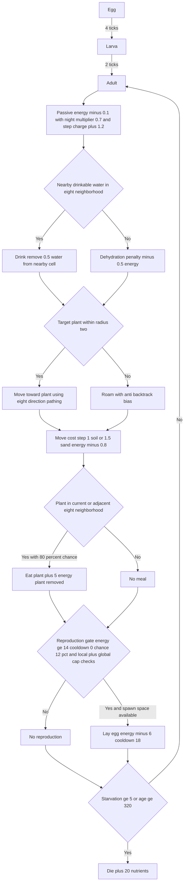

# Terrarium Herbivore Insects Lifecycle

```mermaid
flowchart TD
    H1[Egg] -->|4 ticks| H2[Larva]
    H2 -->|2 ticks| H3[Adult]

    H3 --> H4[Passive energy minus 0.1 with night multiplier 0.7 and step charge plus 1.2]
    H4 --> H5{Nearby drinkable water in eight neighborhood}
    H5 -->|Yes| H6[Drink remove 0.5 water from nearby cell]
    H5 -->|No| H7[Dehydration penalty minus 0.5 energy]

    H6 --> H8{Target plant within radius two}
    H7 --> H8
    H8 -->|Yes| H9[Move toward plant using eight direction pathing]
    H8 -->|No| H10[Roam with anti backtrack bias]

    H9 --> H11[Move cost step 1 soil or 1.5 sand energy minus 0.8]
    H10 --> H11

    H11 --> H12{Plant in current or adjacent eight neighborhood}
    H12 -->|Yes with 80 percent chance| H13[Eat plant plus 5 energy plant removed]
    H12 -->|No| H14[No meal]

    H13 --> H15{Reproduction gate energy ge 14 cooldown 0 chance 12 pct and local plus global cap checks}
    H14 --> H15
    H15 -->|Yes and spawn space available| H16[Lay egg energy minus 6 cooldown 18]
    H15 -->|No| H17[No reproduction]

    H17 --> H18{Starvation ge 5 or age ge 320}
    H16 --> H18
    H18 -->|Yes| H19[Die plus 20 nutrients]
    H18 -->|No| H3
```
