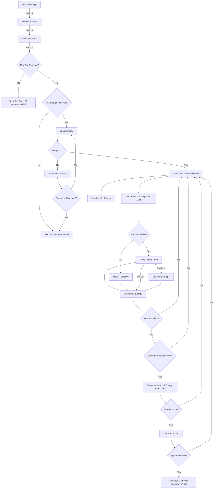

```mermaid
flowchart TD
    direction TB
    %% Herbivore Insects
    H1[Herbivore: Egg] -->|Age +1| H2[Herbivore: Larva]
    H2 -->|Age +1| H3[Herbivore: Adult]
    H3 -->|Age +1| H4{Max Age Reached?}
    H4 -->|Yes| H5[Die of Old Age: +20 Nutrients to Cell]
    H4 -->|No| H6{Has Enough O2/Water?}
    H6 -->|No| H7[Die: +20 Nutrients to Cell]
    H6 -->|Yes| H8[Check Energy]
    H8 --> H9{Energy > 0?}
    H9 -->|No| H10[Starvation Timer +1]
    H10 --> H11{Starvation Timer >= 3?}
    H11 -->|Yes| H7
    H11 -->|No| H8
    H9 -->|Yes| H12[Start Turn: 1 Step Available]
    
    %% Movement and Actions
    H12 --> H13[Determine Visibility: 5x5 Grid]
    H13 --> H14{Plant in Visibility?}
    H14 -->|Yes| H15[Move Toward Plant]
    H14 -->|No| H16[Move Randomly]
    H15 --> H17[Consume 1 Energy]
    H16 --> H17[Consume 1 Energy]
    H17 --> H18{Reached Plant?}
    H18 -->|Yes| H18A{Consume Succeeds? 80%}
    H18A -->|Yes| H19[Consume Plant: +5 Energy, Plant Dies]
    H18A -->|No| H12
    H18 -->|No| H12
    H19 --> H20{Energy >= 10?}
    H20 -->|Yes| H21[Can Reproduce]
    H20 -->|No| H12
    H21 --> H22{Space Available?}
    H22 -->|Yes| H23[Lay Egg: -3 Energy, Cooldown 5 Ticks]
    H22 -->|No| H12
    
    %% Terrain Movement
    H15 -->|On Soil| H17
    H15 -->|On Sand| H24[Consume 2 Steps]
    H24 --> H17
    
    %% Passive Energy Loss
    H12 --> H25[Passive: -0.1 Energy]
```
