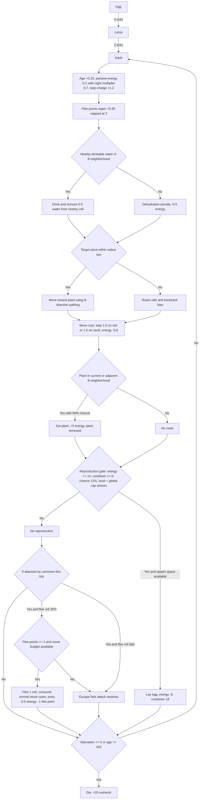

# Terrarium Herbivore Insects Lifecycle

```mermaid
flowchart TD
    H1[Egg] -->|4 ticks| H2[Larva]
    H2 -->|2 ticks| H3[Adult]

    H3 --> H4[Age +0.25, passive energy -0.1 with night multiplier 0.7, step-charge +1.2]
    H4 --> H4A[Flee points regen +0.35 capped at 2]
    H4A --> H5{Nearby drinkable water in 8-neighborhood}
    H5 -->|Yes| H6[Drink and remove 0.5 water from nearby cell]
    H5 -->|No| H7[Dehydration penalty -0.5 energy]

    H6 --> H8{Target plant within radius two}
    H7 --> H8
    H8 -->|Yes| H9[Move toward plant using 8-direction pathing]
    H8 -->|No| H10[Roam with anti backtrack bias]

    H9 --> H11[Move cost: step 1.0 on soil or 1.5 on sand, energy -0.8]
    H10 --> H11

    H11 --> H12{Plant in current or adjacent 8-neighborhood}
    H12 -->|Yes with 80% chance| H13[Eat plant, +5 energy, plant removed]
    H12 -->|No| H14[No meal]

    H13 --> H15{Reproduction gate: energy >= 14, cooldown <= 0, chance 12%, local + global cap checks}
    H14 --> H15
    H15 -->|Yes and spawn space available| H16[Lay egg, energy -6, cooldown 18]
    H15 -->|No| H17[No reproduction]

    H17 --> H17A{If attacked by carnivore this tick}
    H17A -->|No| H18{Starvation >= 5 or age >= 320}
    H17A -->|Yes and flee roll 20%| H17B{Flee points >= 1 and move budget available}
    H17B -->|Yes| H17C[Flee 1 cell, consume normal move costs, extra -0.5 energy, -1 flee point]
    H17B -->|No| H17D[Escape fails attack resolves]
    H17A -->|Yes and flee roll fails| H17D
    H17C --> H18
    H17D --> H18

    H16 --> H18
    H18 -->|Yes| H19[Die, +20 nutrients]
    H18 -->|No| H3
```
