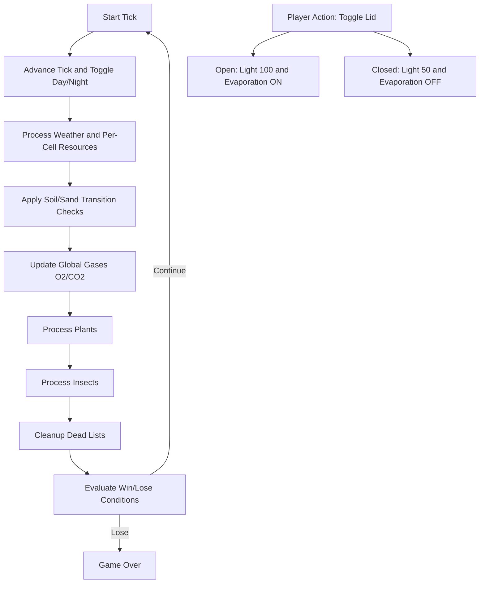

# Terrarium Main Game Loop

```mermaid
flowchart TD
    A[Start Tick] --> B[Advance Tick and Toggle Day/Night]
    B --> C[Process Weather and Per-Cell Resources]
    C --> C1[Apply Soil/Sand Transition Checks]
    C1 --> D[Update Global Gases O2/CO2]
    D --> E[Process Plants]
    E --> F[Process Insects]
    F --> G[Cleanup Dead Lists]
    G --> H[Evaluate Win/Lose Conditions]
    H -->|Lose| I[Game Over]
    H -->|Continue| A

    J[Player Action: Toggle Lid] --> K[Open: Light 100 and Evaporation ON]
    J --> L[Closed: Light 50 and Evaporation OFF]
```
