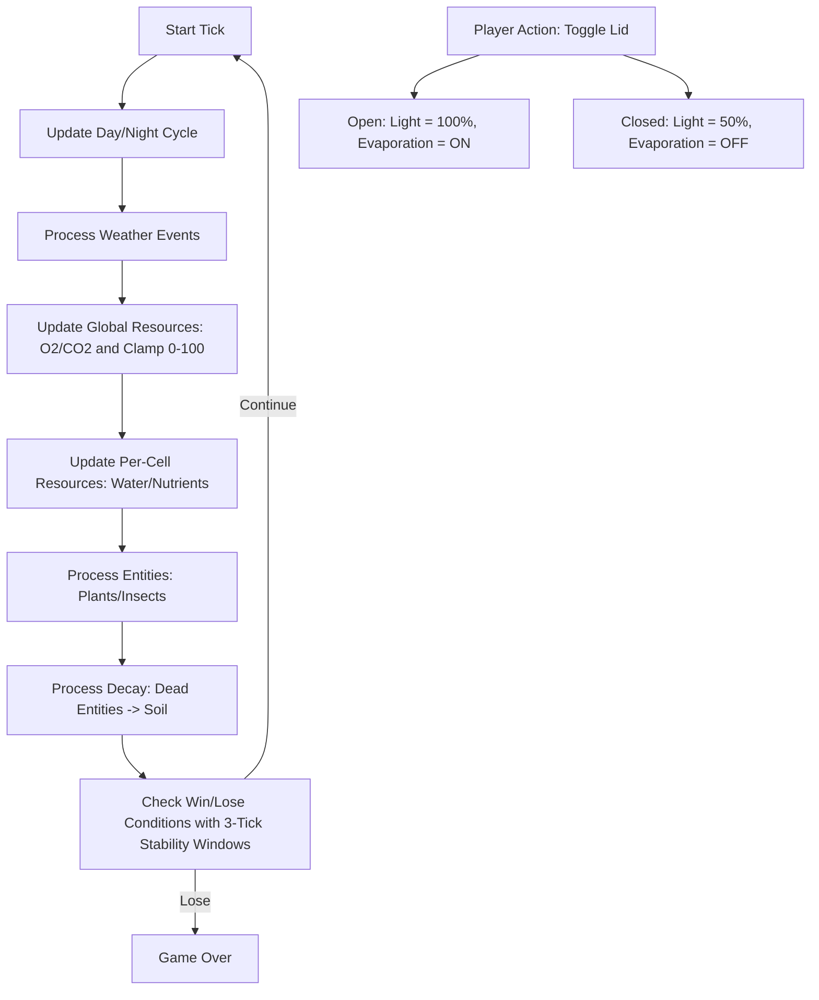

```mermaid
flowchart TD
    A[Start Tick] --> B[Update Day/Night Cycle]
    B --> C[Process Weather Events]
    C --> D[Update Global Resources: O2/CO2 and Clamp 0-100]
    D --> E[Update Per-Cell Resources: Water/Nutrients]
    E --> F[Process Entities: Plants/Insects]
    F --> G[Process Decay: Dead Entities -> Soil]
    G --> H[Check Win/Lose Conditions with 3-Tick Stability Windows]
    H -->|Lose| I[Game Over]
    H -->|Continue| A
    
    %% Lid Mechanic
    J[Player Action: Toggle Lid] --> K[Open: Light = 100%, Evaporation = ON]
    J --> L[Closed: Light = 50%, Evaporation = OFF]
```
