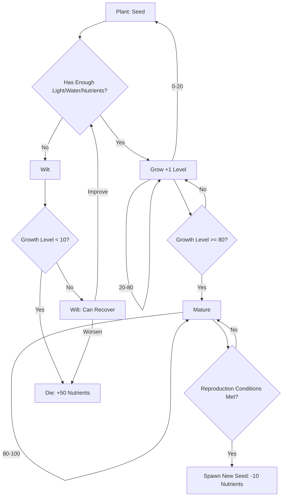

```mermaid
flowchart TD
    A1[Plant: Seed] --> B1{Has Enough Light/Water/Nutrients?}
    B1 -->|Yes| C1[Grow +1 Level]
    B1 -->|No| D1[Wilt]
    C1 --> E1{Growth Level >= 80?}
    E1 -->|Yes| F1[Mature]
    E1 -->|No| C1
    F1 --> G1{Reproduction Conditions Met?}
    G1 -->|Yes| H1[Spawn New Seed: -10 Nutrients]
    G1 -->|No| F1
    
    C1 -->|0-20| A1
    C1 -->|20-80| C1
    F1 -->|80-100| F1
    
    D1 --> I1{Growth Level < 10?}
    I1 -->|Yes| J1[Die: +50 Nutrients]
    I1 -->|No| K1[Wilt: Can Recover]
    K1 -->|Improve| B1
    K1 -->|Worsen| J1
```

Note: If this diagram conflicts with prose mechanics, use README Section 7 (Canonical Conflict-Resolution Rules) as the source of truth.
