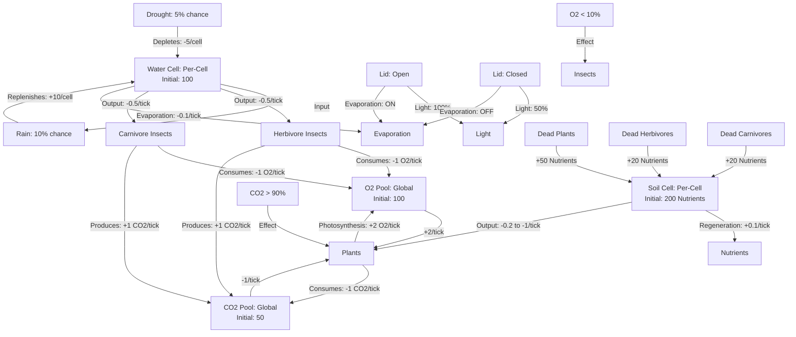

```mermaid
flowchart TD
    %% Global Resources
    O2[O2 Pool: Global
Initial: 100] -->|+2/tick| Plants
    CO2[CO2 Pool: Global
Initial: 50] -->|-1/tick| Plants
    Plants[Plants] -->|Photosynthesis: +2 O2/tick| O2
    Plants -->|Consumes: -1 CO2/tick| CO2
    
    %% Insects
    Herbivore[Herbivore Insects] -->|Consumes: -1 O2/tick| O2
    Herbivore -->|Produces: +1 CO2/tick| CO2
    Carnivore[Carnivore Insects] -->|Consumes: -1 O2/tick| O2
    Carnivore -->|Produces: +1 CO2/tick| CO2
    
    %% Per-Cell Resources
    WaterCell[Water Cell: Per-Cell
Initial: 100] -->|Input| Rain
    WaterCell -->|Output: -0.5/tick| Herbivore
    WaterCell -->|Output: -0.5/tick| Carnivore
    WaterCell -->|Evaporation: -0.1/tick| Evaporation
    
    SoilCell[Soil Cell: Per-Cell
Initial: 200 Nutrients] -->|Regeneration: +0.1/tick| Nutrients
    SoilCell -->|Output: -0.2 to -1/tick| Plants
    
    %% Weather and External Inputs
    Rain[Rain: 10% chance] -->|Replenishes: +10/cell| WaterCell
    Drought[Drought: 5% chance] -->|Depletes: -5/cell| WaterCell
    
    %% Lid Mechanic
    LidOpen[Lid: Open] -->|Light: 100%| Light
    LidOpen -->|Evaporation: ON| Evaporation
    LidClosed[Lid: Closed] -->|Light: 50%| Light
    LidClosed -->|Evaporation: OFF| Evaporation
    
    %% Decay
    DeadPlants[Dead Plants] -->|+50 Nutrients| SoilCell
    DeadHerbivore[Dead Herbivores] -->|+20 Nutrients| SoilCell
    DeadCarnivore[Dead Carnivores] -->|+20 Nutrients| SoilCell
    
    %% Imbalance Effects
    O2Low[O2 < 10%] -->|Effect| Insects
    CO2High[CO2 > 90%] -->|Effect| Plants
```
