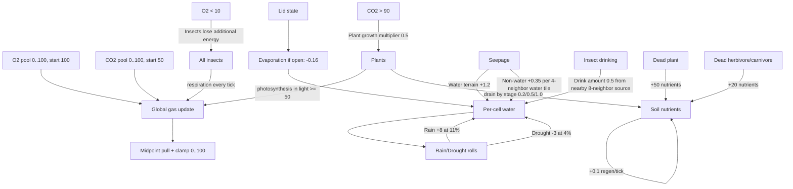

# Terrarium Resource Cycle

```mermaid
flowchart TD
    O2[O2 pool 0..100, start 100] --> Gas[Global gas update]
    CO2[CO2 pool 0..100, start 50] --> Gas
    Plants[Plants] -->|photosynthesis in light >= 50| Gas
    Insects[All insects] -->|respiration every tick| Gas
    Gas --> Clamp[Midpoint pull + clamp 0..100]

    Water[Per-cell water] --> Weather[Rain/Drought rolls]
    Weather -->|Rain +8 at 11%| Water
    Weather -->|Drought -3 at 4%| Water
    Lid[Lid state] --> Evap[Evaporation if open: -0.16]
    Evap --> Water
    Seep[Seepage] -->|Water terrain +1.2| Water
    Seep -->|Non-water +0.35 per 4-neighbor water tile| Water
    InsectDrink[Insect drinking] -->|Drink amount 0.5 from nearby 8-neighbor source| Water

    Soil[Soil nutrients] -->|+0.1 regen/tick| Soil
    Plants -->|drain by stage 0.2/0.5/1.0| Soil

    DeadPlant[Dead plant] -->|+50 nutrients| Soil
    DeadInsect[Dead herbivore/carnivore] -->|+20 nutrients| Soil

    O2Low[O2 < 10] -->|Insects lose additional energy| Insects
    CO2High[CO2 > 90] -->|Plant growth multiplier 0.5| Plants
```
